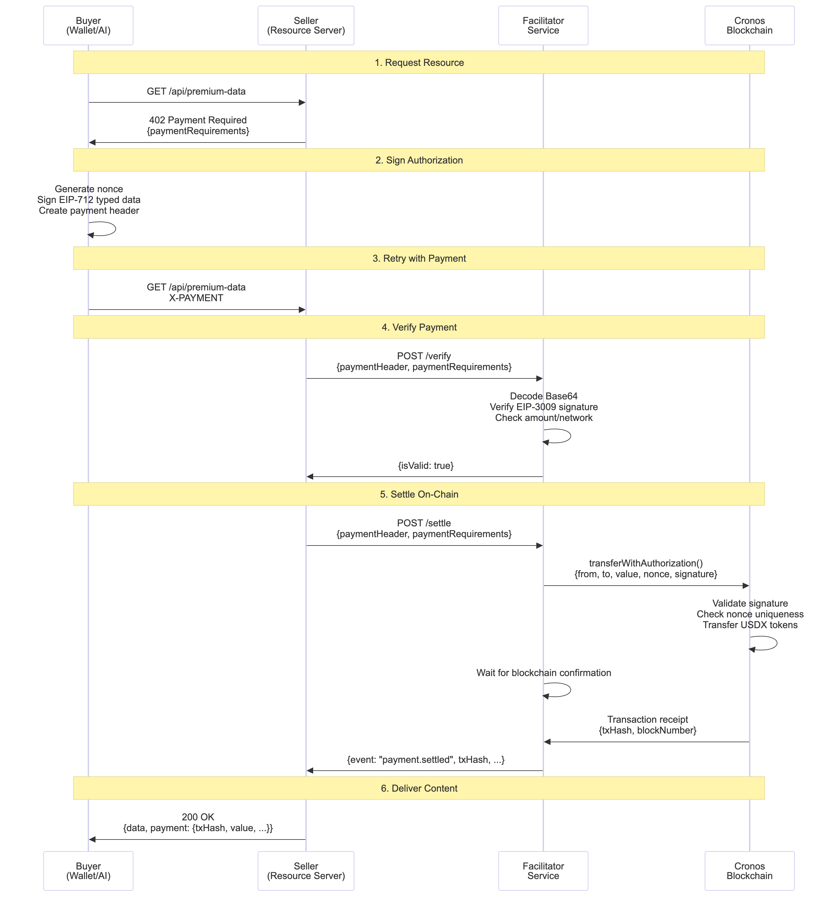

# How It Works

Here’s a high-level diagram of the X402 payment flow:

<figure><figcaption></figcaption></figure>

As you can see above, the x402 payment flow involves four components: **Buyer** (wallet/AI agent), **Seller** (your API/resource server), **Facilitator** (this service), and **Cronos Blockchain**. For implementation guides, see [Quick Start for Buyers](quick-start-for-buyers.md) and [Quick Start for Sellers](quick-start-for-sellers.md).

### Payment Flow

**1. Request Resource**\
The buyer attempts to access a payment-gated resource:

```http
GET /api/premium-data HTTP/1.1
Host: seller-api.example.com
```

The seller's server responds with an HTTP 402 Payment Required status code and payment requirements. The x402 protocol extends the HTTP 402 status code to enable machine-readable payment flows.

```http
HTTP/1.1 402 Payment Required
Content-Type: application/json
```

Response body containing payment requirements:

```json
{
  "error": "Payment Required",
  "x402Version": 1,
  "paymentRequirements": {
    "scheme": "exact",
    "network": "cronos-testnet", // or "cronos" for Cronos Mainnet
    "payTo": "0xSeller...",
    "asset": "0xUSDX...",
    "maxAmountRequired": "1000000",
    "maxTimeoutSeconds": 300
  }
}
```

**2. Sign Authorization**

The buyer's wallet signs an EIP-3009 authorization using EIP-712 typed data, creating a signature that allows the facilitator to transfer tokens on their behalf without needing gas. The signature includes a unique nonce to prevent replay attacks. This authorization is encoded as a Base64 payment header. See [implementation details](quick-start-for-buyers.md#generating-payment-header) for the complete signing flow.

**3. Retry with Payment**

The buyer retries the request with the signed payment header:

```http
GET /api/premium-data HTTP/1.1
Host: seller-api.example.com
X-PAYMENT: eyJ4NDAyVmVyc2lvbiI6MSwic2NoZW1lIjoiZXhhY3QiLC4uLn0=
```

**4. Verify Payment**

The seller forwards the payment header to the facilitator's `/verify` endpoint. The facilitator validates the header structure, decodes Base64, verifies the EIP-3009 signature cryptographically, and checks network/asset/amount requirements, all without an on-chain transaction. For more information, see the [Verify Endpoint](api-reference.md#verify-endpoint) documentation.

**5. Settle On-Chain**

Once verified, the seller requests settlement by calling the facilitator's [Settle Endpoint](api-reference.md#settle-endpoint). The facilitator submits a `transferWithAuthorization` transaction to the Cronos blockchain, paying gas fees on behalf of the buyer. The USDX smart contract validates the signature, checks nonce uniqueness to prevent replay attacks, and transfers tokens from the buyer to the seller. The facilitator waits for blockchain confirmation before returning the transaction receipt to the seller.

**6. Deliver Content**

With payment confirmed on-chain, the seller delivers the protected resource along with transaction details (txHash, blockNumber, timestamp) to the buyer.
