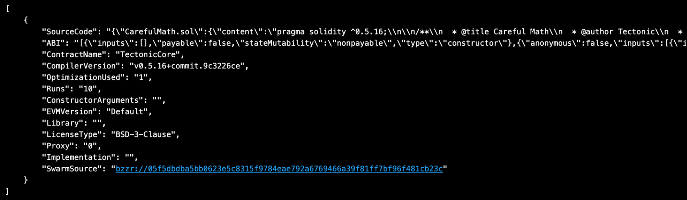
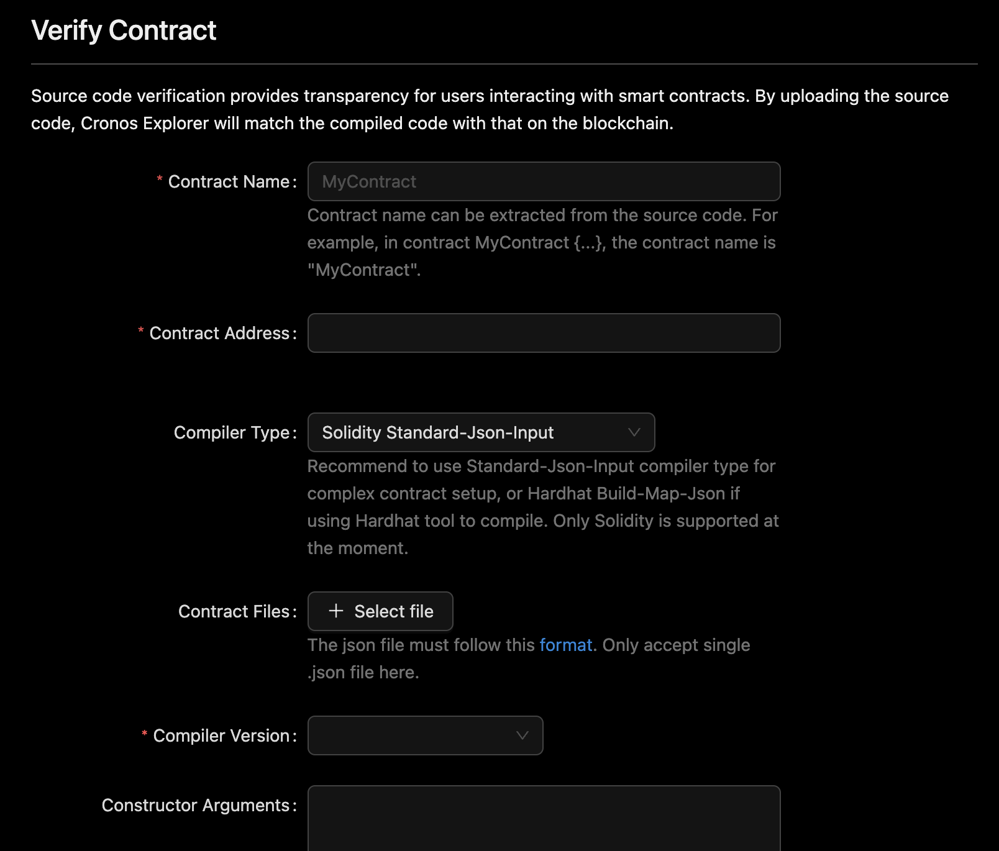
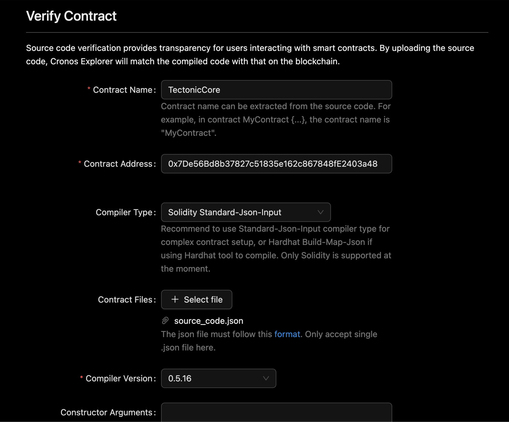

# Contract Verification Export: Cronoscan To Cronos Explorer

## Cronos EVM: how to verify smart contracts on multiple blockchain explorers

As a developer, you may have submitted your smart contract code to a blockchain explorer (e.g., [Cronoscan](https://cronoscan.com/)) as part of your smart contract deployment script. You can also submit it to other platforms for verification (e.g., [Cronos Explorer](https://explorer.cronos.org/)).

This guide explains how to export data from one explorer and upload it into another. However, this only works for one smart contract at a time.

## Step 1: Obtain smart contract data from a blockchain explorer (e.g., Cronoscan)

Cronoscan provides an [endpoint](https://docs.cronoscan.com/api-endpoints/contracts#get-contract-source-code-for-verified-contract-source-codes) for registered users to retrieve contract source code and compilation settings:


```url
https://api.cronoscan.com/api?module=contract&action=getsourcecode&address={YourContractAddress}&apikey={YourApiKeyToken}
```


The parameters are as follows:

* YourContractAddress: address of your smart contract on Cronos EVM chain.
* YourApiKeyToken: API key on the Cronoscan platform.

The output may look like this (example from this contract: [https://cronoscan.com/address/0x7de56bd8b37827c51835e162c867848fe2403a48#code](https://cronoscan.com/address/0x7de56bd8b37827c51835e162c867848fe2403a48#code))

<figure><figcaption></figcaption></figure>

The endpoint's response includes the following fields:

* ContractName: Name of contract
* CompilerVersion: Version name of compiler for contact
* ConstructorArguments: Argument inputs used when creating the contract
* OptimizationUsed: the value is "1" if optimization was used when compiling this contract
* Runs: Number of times the optimization was run
* SourceCode: The source code field's value must be reformatted first. See the instructions below.

## Step 2: Reformat the SourceCode fields' value

The source code field's value may be provided in one of the three following formats:

### Scenario 1: Standard JSON input (starts with "\{{" and ends with "\}}").

In this case, you need to create a .JSON file by following these steps:

* Remove the outer brackets "{" and "}"
* "Unescape" the JSON string. This means replacing the backslashed characters with non-backslashed characters. You can use various tools for this, such as [freeformatter](https://www.freeformatter.com/json-escape.html#before-output) (click: Unescape JSON).
* Paste the resulting string into a new JSON file that you can name, for example, source\_code.json. The JSON file should now be in [this format](https://docs.soliditylang.org/en/latest/using-the-compiler.html#input-description).

### Scenario 2: Source code only, with a single source file (starts with actual source code).

In this case, you need to create a .SOL file. Copy the code and paste it into a new solidity file that you can name, for example, source\_code.sol.

### Scenario 3: Source code only, with multiple source files (starts with a single “{“ and ends with a single "}").

In this case, you need to create a .JSON file by following these steps:

* "Unescape" the JSON string (Once only). This means replacing the backslashed characters with non-backslashed characters. You can use various tools for this, such as [freeformatter](https://www.freeformatter.com/json-escape.html#before-output) (click: Unescape JSON).
* Create a new JSON file that you can name, for example, source\_code.json, using the template below:

```json
{
    "language": "Solidity",
    "sources":**Paste here**   ,
    "settings": {
        "optimizer": {
            "enabled": true,
            "runs": 200
        }
    }
}

```

* In the JSON file that you just created, update the "enabled" and "runs" values to match the OptimizationUsed (where 1 should be converted to true) and Runs values from the Cronoscan response.
* Paste the unescaped JSON string into the JSON file, where "\*\*Paste here\*\*" is a placeholder for where you should insert the unescaped JSON string obtained in the previous step.

```reason
{
    "language": "Solidity",
    "sources": {
        "XXX.sol": {
            "content": "Source code of XXX..."
        },
        "YYY.sol": {
            "content": "Source code of YYY..."
        }
    },
    "settings": {
        "optimizer": {
            "enabled": true,
            "runs": 200
        }
    }
}

```

## Step 3: Submit contract verification into the other blockchain explorer (e.g., Cronos Explorer)

Please visit the [Cronos Explorer User Interface](https://explorer.cronos.org/verifyContract), which looks like this:

<figure><figcaption></figcaption></figure>

You can use the elements from Step 1 to complete the corresponding inputs:

* Contract Name: Refer to the ContractName field from the Cronoscan response.
* Contract Address: Address of the contract.
* Compiler Type: there are two possible scenarios, depending on the format of the source code file generated in Step 2.
  * Scenario 1: The source code is a Solidity file (such as source\_code.sol), generated from a SourceCode value in Source code-only format with a single source file. In that case:
    * Compiler Type: select Solidity Files.
    * Contract Files: Upload the solidity file (.sol) generated in Step 2.
    * Optimizer Enabled: Toggle yes if the OptimizationUsed field from the Cronoscan response is 1.
    * Optimizer Runs: If Optimizer Enabled is toggled, use the value from the Runs field in the Cronoscan response.
  * Scenario 2: The source code is a JSON file (such as source\_code.json) generated from a SourceCode value either in Standard JSON input format or in Source code-only format with multiple source files. In that case:
    * Compiler Type: select Solidity Standard-Json-Input.
    * Check and, if necessary, edit the value of the JSON file as follows:
      * Double check the value of the `settings.optimizer.enabled` field. It must be set to true if the OptimizationUsed field from the Cronoscan response is 1. If there is a mismatch, fix it manually in the source\_code.json file.
      * Double check the value of the `settings.optimizer.runs`field. It must be set to match the value of the Runs field from the Cronoscan response. If there is a mismatch, fix it manually in the source\_code.json file.
* Contract Files: Upload the JSON file (.json) generated in Step 2.
* Compiler Version: Use the value of the CompilerVersion field from the Cronoscan response.
* Constructor Arguments: Use the ConstructorArguments field from the Cronoscan response.

An example of the completed form is shown below:

<figure><figcaption></figcaption></figure>

After submitting the form, you are done!

## Troubleshooting

If you encounter errors, please email [contact@cronoslabs.org](mailto:contact@cronoslabs.org), making sure that you:

* Specify the address of the smart contract.
* Attach the JSON or SOL file generated in Step 2.
* Attach a screenshot of the verification form you completed.

Most of the time, the errors are caused by mistakes when generating the JSON or SOL source code file.\
