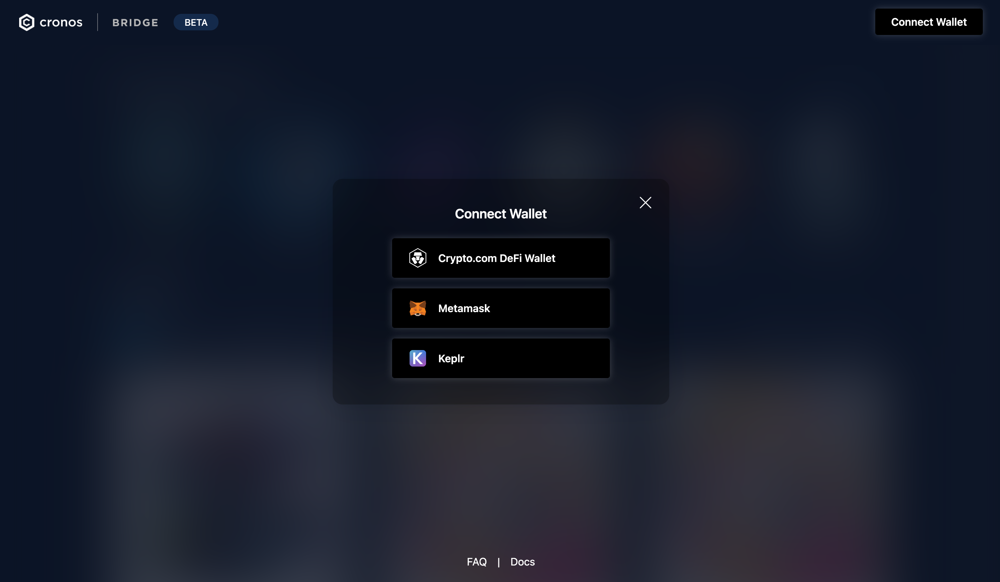
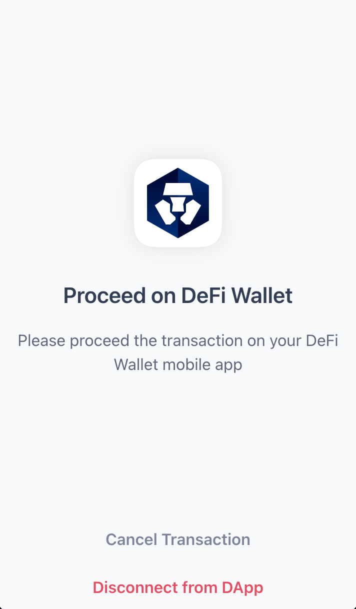
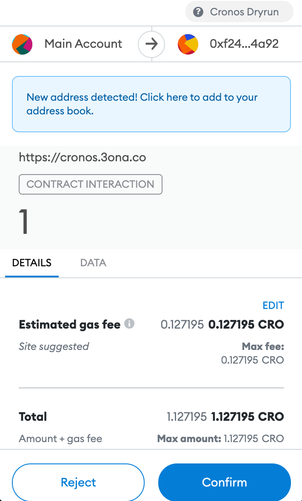
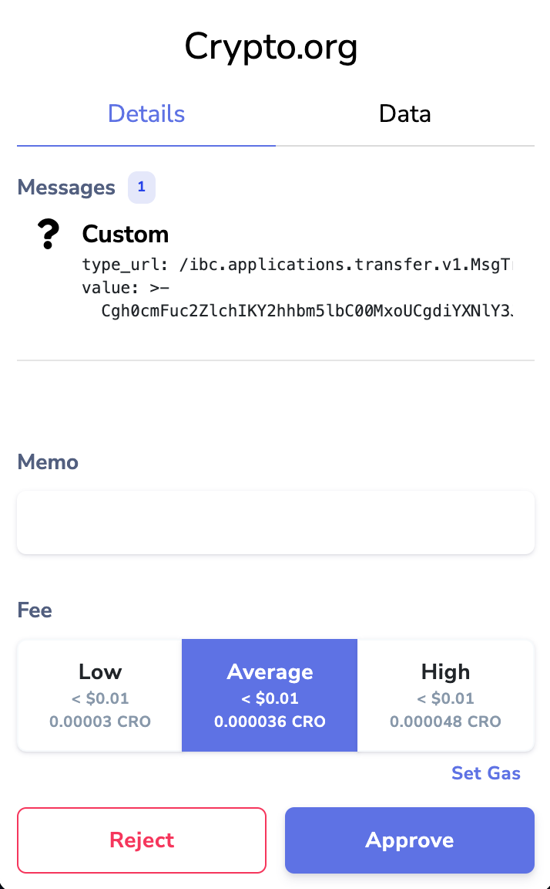
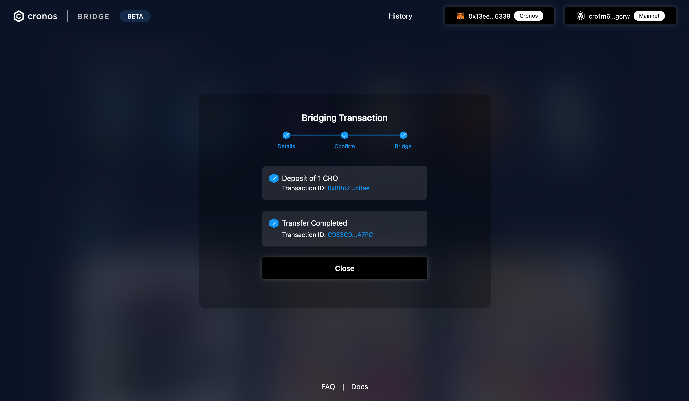
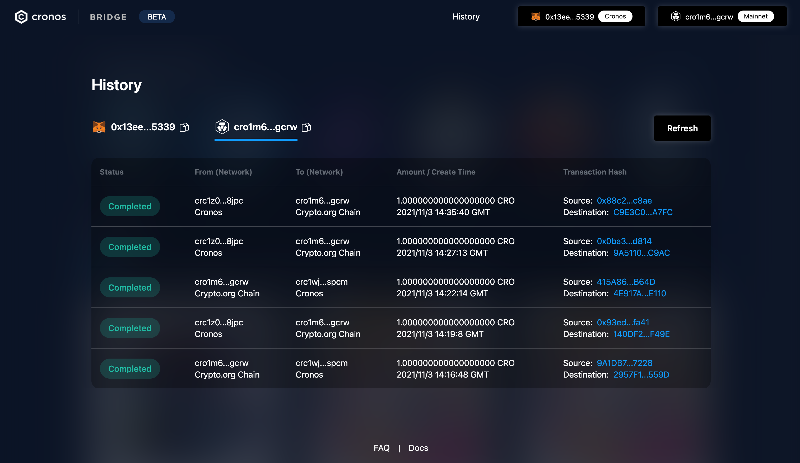

# Cronos Bridge Web App

## Transfer assets from Cronos POS Chain using the Cronos Bridge Web App

### Step-by-step walkthrough

**Step 1: Connect your wallet**

Click “**Connect Wallet**" to connect your cryptocurrency wallet. We currently support browser-compatible versions of Metamask, Keplr, and Crypto.com Onchain Wallet. Once a connection request is sent, look for a popup from your wallet interface or click into the wallet extension to give it consent.


Note 1: If you are bridging assets to or from Crypto.org, you may specify the destination wallet by pasting the address directly or connecting a second wallet to avoid manual errors.


**Step 2. Select Network and Token**

Select the origin chain on the left and destination chain on the right in the Cronos Bridge interface. We will do our best to automatically suggest your wallet network to match the desired transfer parameters. However, a manual adjustment on your end may be needed to set your wallet to match the selected network.

If you are transferring to or from Cronos POS chain, you need to specify the destination address by inputting the address manually or connecting a second wallet to receive your funds.

Once the networks are chosen, select the asset you would like to transfer.

<figure><figcaption></figcaption></figure>

**Step 3. Enter the amount**

Once the network and asset have been chosen, input and confirm the amount you would like to transfer.

Our decentralised bridge protocol does not impose a minimum and maximum amount. However, bridging a very small amount may have a high gas fee in proportion to the amount transferred.

After the amount is entered, the bridge network fees will be calculated accordingly. The bridge itself and Crypto.org do not charge any additional fees.

During the promotional launch period, the network fee incurred by the bridge will be waived. You will still be liable to pay a gas fee directly on your preferred wallet, which is charged by the source network.

Before bridging a large amount, we encourage testing a transfer of a small amount first to ensure that all settings are correct.

<figure><figcaption></figcaption></figure>

**Step 4. Confirm the transaction**

Once all the transfer settings have been confirmed, a transaction confirmation page will pop up, summarising the transaction.

This will send a transaction request to your wallet. Please confirm the request in your wallet to ultimately authorise the transfer.

After bridging the tokens, they will be converted to tokens that are supported by the destination blockchain. For more information, please see this [FAQ](../../faq.md).

<figure><figcaption></figcaption></figure>

**Step 5. Bridging assets**

After the transaction is confirmed from the wallet, the bridge operation will commence.

First, we will initiate and wait for the deposit of assets on the origin chain. Once the deposit is confirmed, we will initiate the transfer in the destination chain to your desired receiving wallet address. Both transactions will include an external link to view and monitor the transaction on-chain via scanning utilities such as the [Cronos POS Chain Explorer](https://cronos-pos.org/explorer/).

Even if you dismiss, quit, or refresh the page, a small popup reminder will be available to indicate an in-progress transaction. A “Transfer Completed” message will confirm that the transaction has been carried out successfully. You may also see a full record of past transactions tied to your wallet in the History tab.

Thank you for using the Cronos Bridge and supporting the Crypto.org ecosystem.

